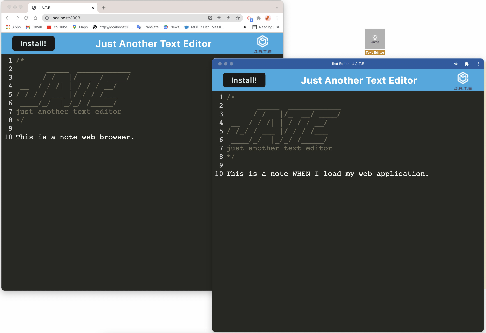
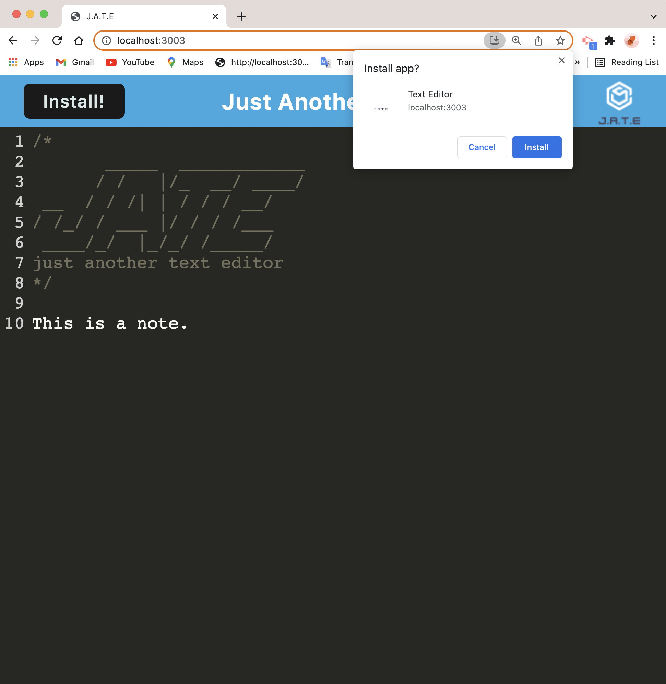
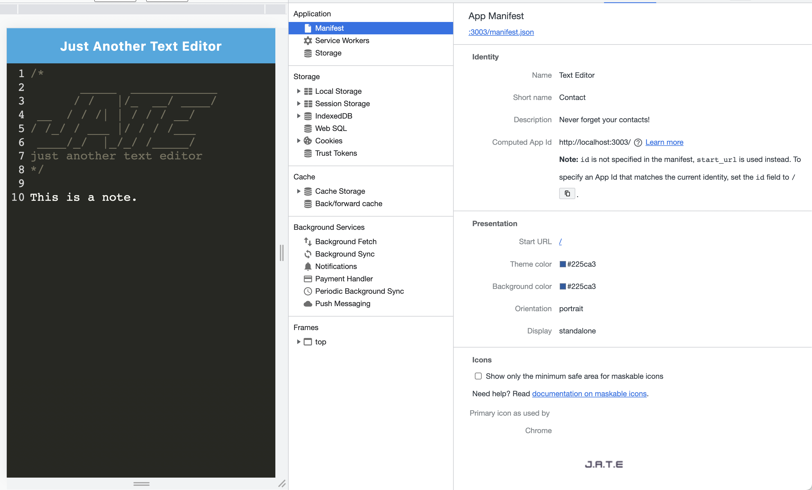
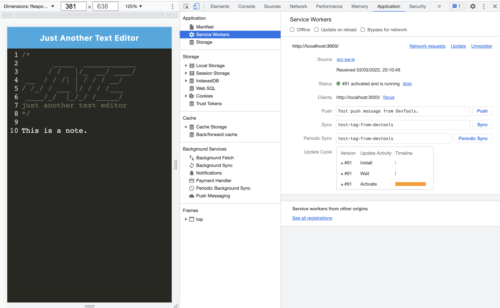

# <Text-Editor>

## Text Editor
This project is a single-page application that meets the PWA criteria which is runing in the browser as well as offline. Additionally, it will feature a number of data persistence techniques that serve as redundancy in case one of the options is not supported by the browser.

## Summery 

```md
GIVEN a text editor web application
WHEN I open my application in my editor
THEN I should see a client server folder structure
WHEN I run `npm run start` from the root directory
THEN I find that my application should start up the backend and serve the client
WHEN I run the text editor application from my terminal
THEN I find that my JavaScript files have been bundled using webpack
WHEN I run my webpack plugins
THEN I find that I have a generated HTML file, service worker, and a manifest file
WHEN I use next-gen JavaScript in my application
THEN I find that the text editor still functions in the browser without errors
WHEN I open the text editor
THEN I find that IndexedDB has immediately created a database storage
WHEN I enter content and subsequently click off of the DOM window
THEN I find that the content in the text editor has been saved with IndexedDB
WHEN I reopen the text editor after closing it
THEN I find that the content in the text editor has been retrieved from our IndexedDB
WHEN I click on the Install button
THEN I download my web application as an icon on my desktop
WHEN I load my web application
THEN I should have a registered service worker using workbox
WHEN I register a service worker
THEN I should have my static assets pre cached upon loading along with subsequent pages and static assets
WHEN I deploy to Heroku
THEN I should have proper build scripts for a webpack application
```

## User Story

```md
AS A developer
I WANT to create notes or code snippets with or without an internet connection
SO THAT I can reliably retrieve them for later use
```

## Built with
  
  * love 

  * package called `idb`, which is a lightweight wrapper around the IndexedDB API

  * IndexedDB to create an object store and includes both GET and PUT methods

  * Bundled with webpack

  * Create a service worker with workbox that Caches static assets

  * The application is use babel in order to use async / await

  * Application have a generated `manifest.json` using the `WebpackPwaManifest` plug-in

  * It Can be installed as a Progressive Web Application


## Link

# This Application deployed to Heroku at live URL with build scripts:
* [Click here to access to Heroku live URL](https://hp-text-editor.herokuapp.com/).


* [Heroku Deployment Guide on The Full-Stack Blog](https://coding-boot-camp.github.io/full-stack/heroku/heroku-deployment-guide).

## The following animation demonstrates the application functionality:



## You can install it with install button or Chrome icon: 


## The following image shows the application's manifest.json file:


## The following image shows the application's registered service worker:



